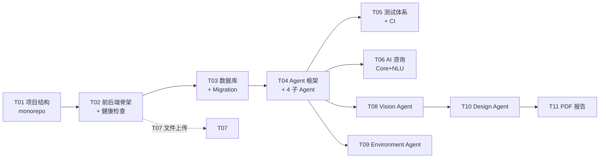

# BOIP 项目初始化分析（Phase 0 Initial Analysis）

**生成日期**：2026-07-26
**生成人**：BOIP AI 主开发工程师
**性质**：初始化分析 / 现状盘点（无代码改动）
**配套事实来源**：`BOIP_AI_Documents/`（上游 18 份设计 + 4 份方案）、`BOIP/docs/*`、`git log`、仓库源码结构、`.env` 与 `agents/config.yaml` 实测。

---

## 0. 关键说明：你指定的 4 个读取文件不存在

任务要求先读取 `AGENTS.md` / `WORKBUDDY.md` / `计划/00_DOCUMENT_INDEX.md` / `.ai/project_context.md`。**经全盘检索，这 4 个文件在当前仓库均不存在**：

| 指定文件 | 实际情况 |
|---|---|
| `AGENTS.md`（根） | 不存在；真实文档在 **`docs/AGENTS.md`**（Phase 1 才补建） |
| `WORKBUDDY.md` | 不存在（仓库无此文件） |
| `计划/00_DOCUMENT_INDEX.md` | 不存在；无 `计划/` 目录。文档索引功能由 **`docs/README.md`** + `BOIP_AI_Documents/` 承担 |
| `.ai/project_context.md` | 不存在；无 `.ai/` 目录（本报告即新建 `.ai/tasks/`） |

> 因此本分析基于**真实存在且权威**的素材：上游 `BOIP_AI_Documents/`（22 个 md，含任务树、技术债、架构、路线图）、`docs/` 工程文档集、实际源码与 `git` 历史。如主理人确有上述 4 文件的另一版本，请指路径，我重新对齐。

---

## 1. 项目理解

### 1.1 项目是什么

**BOIP（Building Opening Intelligence Platform）** = 面向「建筑开口 / 门窗阳台」行业的 **AI Native 智能设计与经营平台**。定位不是门窗软件、不是报价工具、不是聊天机器人，而是把「老师傅经验」沉淀为**可复用、可学习、可解释的数字资产**，重塑建筑开口行业的工作流。

### 1.2 V1.0 商业闭环（必须最先跑通）

```
业主输入（地址 + 楼层 + 朝向 + 阳台照片 + 使用需求）
  ↓
[Environment Agent] 风压 / 湿度 / 盐雾 / 日照 风险分析
[Vision Agent]      阳台类型 / 窗洞 / 尺寸 / 障碍物识别
[Design Agent]      经济 / 舒适 / 高性能 三方案生成
  ↓
输出：方案 PDF + 推荐理由 + 报价建议
  ↓
销售跟进 → 施工 → 验收 → 售后 → 数据沉淀
```

### 1.3 战略分层（长期）

- 对内执行级：文档主张 **Phase 0–7（8 阶段）**，粒度最细（见 `BOIP_PROJECT_TASK_TREE.md`）。
- 对外里程碑：文档主张 **V1.0–V5.0（5 版本）**（见 `17_ROADMAP.md`）。
- **阶段编号冲突**是已知技术债（TD-001），尚未由主理人拍板统一。

### 1.4 不可越界红线（来自 `16_AI_DEVELOPMENT_RULES.md`）

- ❌ 随意改核心架构 / 删已有功能
- ❌ **编造行业数据**：任何无据数字一律 `pending_verification`
- ❌ 忽略工程安全 / 上线无测试 / 为简单牺牲扩展性

> 这些红线直接决定了「当前工程状态」的判断口径：**所有业务数值当前都应是占位/待验证**，凡是写死真实工程参数（风压阈值、楼层分级、评分权重）都属于越界。

---

## 2. 当前工程状态

### 2.1 一句话结论

**文档层面**：Phase 0 已整体验收（IS_PASS：YES），并推进到 Phase 1 的 T06（对话）/ T07（上传+密钥）/ T08（Vision）。
**代码层面（git 实测）**：已越过 Phase 1，进入 **Phase 2 早期**——真实三 Agent 链路（minimax）、PDF 方案书端点、前端 consult/结果页打通、Vision 接入 TokenHub 多模态均已提交。
**最突出的问题**：**文档 / 配置严重滞后于代码约 2 个阶段**，这是当前第一风险。

### 2.2 任务 → 文档声明 → 代码实测 对照表

| 任务 | 文档声明状态 | 代码 / git 实测证据 | 判定 |
|---|---|---|---|
| T01 项目结构 | IS_PASS YES | monorepo 五大域齐全 | ✅ 一致 |
| T02 前后端骨架 | IS_PASS YES | FastAPI 4+ 路由、Next.js 占位齐全 | ✅ 一致 |
| T03 数据库 | IS_PASS YES | 8 表 + Alembic 首迁 + seed | ✅ 一致 |
| T04 Agent 框架 | IS_PASS YES | BaseAgent/Registry/Loader + 4 Agent 四件套 | ✅ 一致 |
| T05 测试体系+CI | IS_PASS YES | pytest 65 / jest 6 / local_ci 8 步（旧值） | ✅ 一致（基线） |
| T06 对话能力 | IS_PASS YES（待测试确认） | `agents/core/nlu.py`、`orchestrator.chat()`、conversations API | ✅ 已落地 |
| T07 上传+LLM密钥 | CHANGELOG 记为 DashScope qwen-max | **`.env` 中 `LLM_A_*` 全为空值**；git 显示实际走 minimax / TokenHub | ⚠️ **文档与配置漂移** |
| T08 Vision+图片 | CHANGELOG：IS_PASS 待验证 | `vision_tasks.py`、`image_processor.py`、`uploads.py`、`models/image.py`、commit `f53b4be`（TokenHub HY-Vision-2.0-Instruct） | ✅ 已落地，但 provider 未在文档同步 |
| Phase 2 三 Agent 链路 | 文档未覆盖 | commit `7e2a585`：minimax 真实三 Agent 链路 + PDF endpoint + 前端 consult/结果页 + asyncio 零告警 | 🔴 **代码领先文档 2 阶段** |

### 2.3 测试与质量基线（来自 PHASE0_DONE.md，仍有效）

- 后端 pytest：65 passed，覆盖率 **91.18%**（门禁 ≥60%）
- 前端 jest：6 passed，statements/lines **93.15%**（门禁 ≥50%）
- `local_ci.sh` 8 步全绿（Ruff / pytest / ESLint / jest / alembic roundtrip / seed / 业务数字扫描 / 硬编码扫描）
- `check_phase0_done.sh` 终验通过

> ⚠️ 上述数字是 **Phase 0 末基线**。T06/T08/Phase2 已新增大量代码与测试，但**未见更新的覆盖率报告**，建议立即重跑 `local_ci.sh` 取得 Phase 2 真实门禁数据。

### 2.4 运行态配置实测（`agents/config.yaml` + `.env`）

- `config.yaml`：`llm.enabled: true`，`track_a.provider: openai_compat`（注释写 DashScope qwen-max），`track_b.provider: mock`。
- `.env`：`LLM_A_BASE_URL / LLM_A_API_KEY / LLM_A_MODEL` **均为空**；`LLM_B_*` 也为空。
- 推论：config.yaml 声明的 `openai_compat` track_a **实际无密钥可用 → 会静默回落 mock**；而 git 中的真实链路用的是 **TokenHub（Vision）+ minimax（三 Agent）**，二者**未在 `config.yaml`/`docs/LLM.md` 体现** → 配置即文档债。

### 2.5 代码仓状态

- 当前分支：`master`（任务树/CHANGELOG 曾提 `main`/`develop` 受保护分支，实际落地为 `master`，需确认是否合规）。
- 工作树未跟踪项：`deliverables/`（产物目录，合理）、`frontend/.next.trash/`（**Next 构建垃圾目录，应加入 .gitignore 或清理**）。
- 最新 4 次提交（2026-07-25~26）均围绕真实 LLM 接入与 Phase 2 打通，说明项目处于**活跃开发、快速推进**状态。

---

## 3. 技术架构分析

### 3.1 分层架构（融合 `04/05/08` 设计文档 + 实际落地）

```
[用户层]   Web / 移动 / 企业 / 设计师 / 施工端
   ↓
[应用层]   Next.js 14（前端）+ FastAPI（后端 API Gateway）
   ↓
[AI Agent 层]  Core(编排) → Environment / Vision / Design（+ 待补 Engineer…）
   │            ↘ LLM 抽象层（DualTrackRouter：track_a / track_b / mock）
   ↓
[业务服务层] User / Project / File(AI) / Knowledge / Engineering(待) / Quotation(待) …
   ↓
[数据层]   PostgreSQL(业务) / SQLite(Phase0 占位回归) / Redis / Qdrant / MinIO(待接)
   ↓
[基础设施] Docker / Nginx / 监控 / 备份
```

### 3.2 已落地的关键模块

| 层 | 模块 | 文件 | 状态 |
|---|---|---|---|
| Agent 框架 | BaseAgent / Registry / Loader / config | `agents/{base,registry,loader,config.yaml}.py` | 稳定 |
| Agent 编排 | CoreOrchestrator + NLU | `agents/core/{orchestrator,nlu}.py` | 稳定，已接 chat |
| LLM 抽象 | OpenAI/Anthropic 兼容 + Mock + DualTrackRouter | `agents/llm/*` | 框架在，provider 漂移 |
| Vision | 图片上传 + 多模态识别 + 后台任务 | `agents/vision/*`、`backend/app/api/{uploads,vision}.py`、`tasks/vision_tasks.py` | 接 TokenHub 真实模型 |
| 对话 | 会话 / 消息 ORM + REST | `backend/app/api/conversations.py`、`models/{conversation,message}.py` | 在 |
| 报告 | PDF 方案书生成 | `agents/report/generator.py`、`backend/app/api/report.py` | Phase 2 新增 |
| 数据 | 10+ ORM 模型 + Alembic | `backend/app/db/models/*` | 扩展中 |
| 前端 | consult 聊天页 + 结果页 + 组件 | `frontend/src/app/consult`、`components/*` | Phase 2 打通 |

### 3.3 架构亮点（值得保持）

1. **Agent 四件套 + 注册中心**：`agent.md/prompt.md/tools.md/tests.md` 强制约定，扩展 Agent 成本低。
2. **LLM 双轨 + Mock 兜底**：`MockProvider` 保证无 key 不崩，利于离线开发。
3. **统一信封协议**：`{success, data, evidence}`（Agent）与 `{success, data, message}`（REST），前后端契约清晰。
4. **业务数字零杜撰扫描**：`scripts/lint/check_fabrication.py` 强制 `pending_verification`，守住合规底线。
5. **Mono-repo + 本地 CI 8 步**：门禁前置，质量反馈快。

### 3.4 架构隐患（详见第 5 节）

- **Session 同步/异步未决（TD-012）**：`app/db/session.py` 仅同步 `SessionLocal`，但 FastAPI 路由是 `async def`，Phase 2 已引入真实 DB 查询，阻塞风险已逼近。
- **SQLite 占位 vs PG JSONB（TD-011）**：所有 JSON 字段在 SQLite 退化为 TEXT，生产 PG 行为未验证。
- **provider 配置漂移**：config.yaml 与真实链路（TokenHub/minimax）不一致。
- **Engineering Agent 缺位（TD-005）**：编排管道 `engineering_enabled: false`，四阶段只跑三阶段，工程安全审核链未闭合。

---

## 4. Phase 0 任务树

> 来源：`BOIP_AI_Documents/BOIP_PROJECT_TASK_TREE.md` 第三章 + PHASE0_DONE.md。Phase 0 自身为 **T01–T05 五件事**，串行依赖。

### 4.1 Phase 0 子任务树（Mermaid）



### 4.2 Phase 0 五件事清单（一级节点）

| 编号 | 任务 | 阶段 | 优先级 | 依赖 | 文档 IS_PASS | 代码实测 |
|---|---|---|---|---|---|---|
| T01 | 项目结构（monorepo） | Phase 0 | P0 | — | ✅ YES | ✅ 一致 |
| T02 | 前后端骨架 + 健康检查 | Phase 0 | P0 | T01 | ✅ YES | ✅ 一致 |
| T03 | 多数据库初始化 + Migration | Phase 0 | P0 | T02 | ✅ YES | ✅ 一致（PG 未真连） |
| T04 | Agent 基础框架 + 4 子 Agent | Phase 0 | P0 | T03 | ✅ YES | ✅ 一致 |
| T05 | 测试体系 + CI 入口 | Phase 0 | P0 | T04 | ✅ YES | ✅ 一致（基线） |

### 4.3 依赖关系（强制顺序）

```
T01 → T02 → T03 → T04 → T05  （Phase 0 串行闭环）
T02 → T07（文件上传）
T04 → T06 / T08 / T09（三 Agent 并行起点）
T08 + T09 → T10（Design 依赖两数据源）
T10 → T11（PDF）
```

### 4.4 Phase 0 任务树「完成度」总评

- **T01–T05 全部 IS_PASS：YES**，证据充分（测试 + CI + 终验脚本）。
- **Phase 0 任务树本身已完成**，但**整棵大树的后续节点（T06–T20）已实际开工且超前**：T06/T07/T08/Phase2 均已提交代码，而任务树文档仍停留在 Phase 0 视角。
- 建议：将任务树升级为「**实时任务树**」，把已提交但未在树中闭环的 T06/T07/T08/Phase2 节点正式入账，并标记真实状态。

---

## 5. 开发风险

### 5.1 当前最紧迫风险（按严重度排序）

| # | 风险 | 等级 | 证据 | 建议动作 |
|---|---|---|---|---|
| R1 | **文档/配置严重滞后于代码（约 2 阶段）** | 🔴 高 | CHANGELOG 止步 T08；git 已到 Phase 2（minimax/TokenHub/PDF）；config.yaml 仍写 DashScope qwen-max 而 `.env` 全空 | 立即补 `CHANGELOG` + `PHASE0_LOG` 到 Phase 2；重对齐 `config.yaml` 与真实 provider；补 `docs/AGENTS.md` 的 Vision/Report 章节 |
| R2 | **provider 配置漂移 / 密钥悬空** | 🔴 高 | `config.yaml` `llm.enabled=true` 但 `.env` `LLM_A_*` 空值；真实走 TokenHub+minimax 未在配置声明 | 明确「单一事实源」：要么 config.yaml 反映真实 provider，要么代码读取统一 env；清理空密钥，避免静默 mock 误判 |
| R3 | **Session 同步/异步未决（TD-012）** | 🟠 中 | `session.py` 仅同步 `SessionLocal`，Phase 2 已真实查库于 `async` 路由 | Phase 2 首个 DB 重路由前必须定调（建议 `AsyncSession` + `async_get_db`，alembic 仍同步） |
| R4 | **工程安全审核链未闭合（TD-002 / TD-005）** | 🟠 高 | `engineering_enabled: false`；风压/楼层/评分权重全 `pending_verification`，无领域专家签字 | 任何「方案建议/报价」上线前必须有 Engineer Agent + 专家评审；当前仅三 Agent 链路不可出工程结论 |
| R5 | **SQLite 占位 vs PG JSONB（TD-011）** | 🟠 中 | 大量 JSON 字段 SQLite=TEXT；生产 PG 未跑 `EXPLAIN ANALYZE` | 接入真实 PG 后跑一轮 JSON 查询比对，必要时补 `gin` 索引 |
| R6 | **覆盖率门禁数据陈旧** | 🟠 中 | 最新覆盖率仍引用 Phase 0 基线（91.18%/93.15%），Phase2 新增代码未重新度量 | 立即重跑 `local_ci.sh` 取得真实门禁；若跌破 60%/50% 立即补测 |
| R7 | **测试收集冲突（PHASE0_DONE 第四章 #2）** | 🟡 低 | `backend/tests/factories.py` 与 `tests.factories` import 冲突，`pytest tests/` 会中断 | 第一个 PR 修 import，使 `pytest tests/` 与 `pytest tests/ tests/agents/` 均可独立跑 |
| R8 | **分支策略 / 仓库卫生** | 🟡 低 | 实际为 `master`（非文档所述 main/develop）；`frontend/.next.trash/` 未忽略 | 确认分支模型；把 `.next.trash` 加入 `.gitignore` 并清理 |

### 5.2 延续自上游的未决技术债（TD 汇总）

**OPEN（14 条）**：TD-001 阶段编号冲突、TD-002 工程阈值未确认（高）、TD-003 文档/代码版本联动、TD-005 Agent 数量、TD-006 LLM 选型、TD-007 i18n、TD-008 密钥管理基建、TD-009 前端组件库、TD-010 后端拆分粒度、TD-011 SQLite↔PG、TD-012 Session 同步异步、TD-013 双轨 LLM 成本/性能（高）、TD-014 真实 LLM key 接入（IN_PROGRESS）、TD-015 图片存 MinIO、TD-016 Vision prompt 待专家调优（高）。
**RESOLVED（1 条）**：TD-004 测试覆盖率门禁。

> 偿还目标（来自技术债维护规则）：Phase 1 末 OPEN ≤ 10；Phase 2 末 ≤ 5。**当前 14 条 OPEN 已超 Phase 1 末目标**，且因代码超前、文档滞后，实际债可能更多（如 R1/R2 未入账）。

### 5.3 业务 / 合规风险（不可轻视）

- **编造行业数据**：所有工程参数必须 `pending_verification`，任何写死数字（风压 Pa、楼层分级、评分权重）均属越界，需专家签字方可采信。
- **数据出境合规**：真实 LLM（TokenHub/minimax/DashScope）接入后，需评估《数据安全法》与数据出境要求（TD-FUTURE-004）。
- **密钥管理**：仅靠 `.env`，尚无 Vault/云密钥服务（TD-008），正式环境接入前必须补齐。

---

## 6. 给主理人的下一步建议（等待指令）

1. **先对齐事实**：认可「代码已到 Phase 2、文档滞后」这一事实，授权我补全 `CHANGELOG`/`PHASE0_LOG`/`docs/AGENTS.md` 到真实状态（属文档同步，不改业务代码）。
2. **拍板 provider 单一事实源**：确定 TokenHub / minimax / DashScope 谁是 track_a/track_b，落到 `config.yaml` + `.env`，消除静默 mock。
3. **定调 Session 模型**（TD-012）：建议 `AsyncSession`，避免在 async 路由用同步 session 阻塞事件循环。
4. **重跑质量门禁**：`bash scripts/ci/local_ci.sh` 取得 Phase 2 真实覆盖率与 8 步结果。
5. **确认分支模型**：`master` 是否为正式主干；清理 `.next.trash`。
6. **领域专家评审**：TD-002 / TD-016 的工程阈值与 Vision prompt，需建筑开口设计师签字。

---

**附录：本分析使用的真实素材清单**
- `BOIP_AI_Documents/`：00_MASTER_START、01~17 设计文档、`BOIP_PROJECT_TASK_TREE.md`、`technical_debt.md`、`BOIP_PHASE0_INIT_PLAN.md`、`BOIP AI开发启动操作说明.md`
- `BOIP/docs/`：AGENTS.md、CHANGELOG.md、PHASE0_DONE.md、PHASE0_LOG.md、LLM.md、VISION.md、TESTING.md、API.md、CONVERSATION_API.md
- 实测：`git log`（最近 4 提交 2026-07-25~26）、`agents/config.yaml`、` .env`（键名，未取值）、`backend/app`、`agents/`、`frontend/src` 目录结构

**END**
