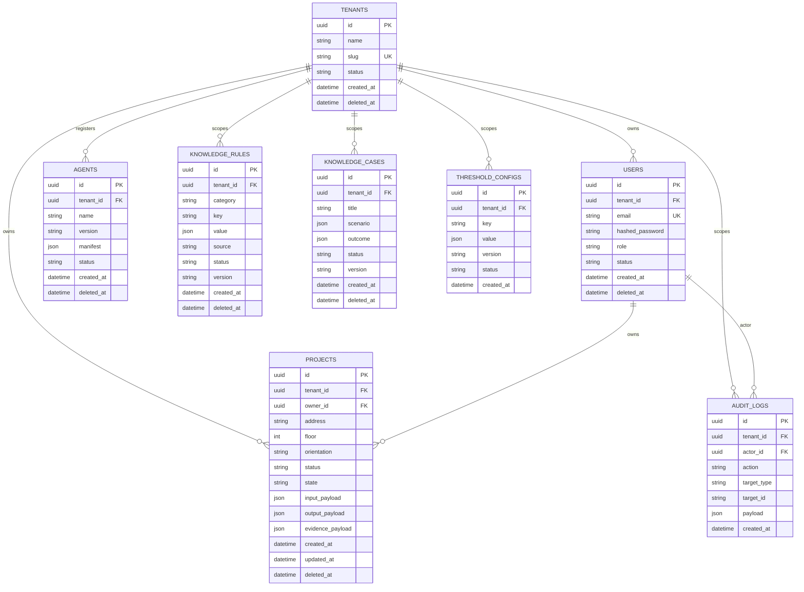

# BOIP 数据库设计与迁移指南（Phase 0）

> 配套文档：`BOIP_AI_Documents/07_DATABASE_DESIGN.md`（上游设计 V1.0）、`BOIP_AI_Documents/16_AI_DEVELOPMENT_RULES.md` 第六章（数据库结构纪律）。
>
> 范围：Phase 0 落地的 8 张核心关系表 + alembic 迁移流程 + 种子数据。Phase 1+ 的 17 张扩展表、组织/权限细分、向量与文档库见上游设计文档。

---

## 1. 选型与原则

| 项 | Phase 0 选择 | 备注 |
|---|---|---|
| 主关系库 | PostgreSQL 16 | 生产目标；本地/CI 用 SQLite 占位 |
| ORM | SQLAlchemy 2.0 + Alembic 1.14 | 同步模式，便于 alembic autogenerate |
| 主键策略 | UUID v4（PG native UUID / SQLite CHAR(36)） | 跨服务无 ID 冲突 |
| 时间戳 | `DateTime(timezone=False)` + `server_default=func.now()` | 服务端生成，避免客户端时钟漂移 |
| 多租户隔离 | `tenant_id` 外键 + 软删除 `deleted_at` | Phase 3 强化为行级安全 |

**Phase 0 纪律（沿用 16 第六章）**：

- 禁止任何业务阈值数字（风压/楼层/厚度/权重等）入表或代码，全部 `pending_verification`；
- 禁止运行时直接 `Base.metadata.create_all`；必须走 alembic migration；
- 任何结构变更需先建 migration → 升级 → 回滚演练，再合并。

---

## 2. 表清单（8 张）

| 表 | 主键 | 关键字段 | 业务含义 |
|---|---|---|---|
| `tenants` | UUID | name, slug(UNIQUE), status | 租户/组织起点，所有业务表的 `tenant_id` 来源 |
| `users` | UUID | tenant_id, email(UNIQUE), hashed_password, role, status | 账号 + 角色 + 所属租户 |
| `projects` | UUID | tenant_id, owner_id, address, floor, orientation, status, state, input_payload, output_payload, evidence_payload | 建筑开口项目聚合根；3 个 JSONB 存 AI 进出 + 证据 |
| `agents` | UUID | tenant_id, name, version, manifest, status | Agent 注册表（Phase 0 4 个核心 Agent 占位） |
| `knowledge_rules` | UUID | tenant_id, category, key, value, source, status, version | 知识规则表（pending_verification） |
| `knowledge_cases` | UUID | tenant_id, title, scenario, outcome, status, version | 知识案例表（pending_verification） |
| `audit_logs` | UUID | tenant_id, actor_id, action, target_type, target_id, payload | 追加写审计 |
| `threshold_configs` | UUID | tenant_id, key, value, version, status | 强制复核阈值占位 |

所有表共有的元字段：

- `created_at`：`server_default=func.now()`；
- `updated_at`：仅 `projects` / 含 `onupdate=func.now()`；
- `deleted_at`：可空，软删除标记（Phase 3 启用行级过滤）。

---

## 3. ER 图（Mermaid）



> ⚠ Mermaid 渲染提示：GitHub / VSCode Markdown Preview Mermaid 插件可直接渲染；若 CI 需要导出 PNG，可使用 `mmdc -i DATABASE.md -o database.png`。

---

## 4. tenant_id 隔离策略

1. **物理隔离（Phase 0）**：每张业务表都带 `tenant_id`，写入/查询必须显式带 `tenant_id`。
2. **逻辑隔离（Phase 0 落地）**：
   - `tenants.slug` 全局唯一，避免跨租户混淆；
   - `users.email` 全局唯一，Phase 3 改为 `(tenant_id, email)` 复合唯一。
3. **软删除（已就位）**：所有业务表预留 `deleted_at`；查询需过滤 `WHERE deleted_at IS NULL`。
4. **行级安全（Phase 3+ 计划）**：PG RLS 配合 session var；Phase 0 仅靠应用层 WHERE 条件。

> 后续在 repository 层（`backend/app/repositories/`，Phase 1 创建）必须强制注入 `tenant_id`，禁止裸露全表查询。

---

## 5. 迁移指南（Alembic）

### 5.1 配置文件

- `backend/alembic.ini`：SQLAlchemy URL 占位；脚本目录 `alembic/`。
- `backend/alembic/env.py`：
  - 从环境变量 `DATABASE_URL` 读取 URL；
  - 缺省回退 `sqlite+pysqlite:///:memory:`，便于本地/CI 演练；
  - `target_metadata = Base.metadata`（来自 `app.db.base`）。

### 5.2 常用命令

```bash
cd backend

# 1. 生成新 migration（自动比对当前 model 与 DB）
.venv/bin/alembic revision --autogenerate -m "<change_summary>"

# 2. 升级到最新
.venv/bin/alembic upgrade head

# 3. 回滚 1 个版本
.venv/bin/alembic downgrade -1

# 4. 回滚到初始（仅 SQLite/测试库；生产严禁）
.venv/bin/alembic downgrade base

# 5. 查看当前版本
.venv/bin/alembic current

# 6. 查看历史
.venv/bin/alembic history --verbose
```

### 5.3 现有 Migration 文件

| 修订号 | 名称 | 描述 |
|---|---|---|
| `d17f02429ce9` | `phase0_init_schema` | 8 张业务表 + 全部 FK/Index/Check |

### 5.4 升级/回滚演练

`scripts/ci/local_ci.sh` 步骤 `[3/6]` 自动跑：

```text
DATABASE_URL=sqlite+pysqlite:///<tmp>.db alembic upgrade head
DATABASE_URL=sqlite+pysqlite:///<tmp>.db alembic downgrade base
```

确保任何新 migration 都能在 SQLite 上完整 round-trip；生产 PG 兼容性由人工 review 保证。

### 5.5 新增表 / 字段的流程

1. **禁止** 直接修改 DB：必须改 ORM 模型。
2. 在 `app/db/models/<table>.py` 内更新模型（保持 NamingConvention）。
3. 跑 `alembic revision --autogenerate -m "..."`；检查生成文件：
   - 索引命名 `ix_<table>_<col>`；
   - FK 命名 `fk_<table>_<col>_<referenced>`；
   - CheckConstraint 命名 `ck_<table>_<short_name>`。
4. 手动追加 `op.batch_alter_table`（SQLite 兼容性）。
5. 本地跑 `alembic upgrade head && alembic downgrade base`；CI 自动覆盖。
6. 更新 `docs/CHANGELOG.md` 与本文件 §5.3 表。

---

## 6. 种子数据

文件：`backend/scripts/seed.py`

执行：

```bash
cd backend
.venv/bin/python scripts/seed.py
```

幂等输出（重复运行不会重复插入）：

```text
Seed completed:
  - tenants: 1
  - users: 1
  - agents: 4
  - knowledge_rules: 5
  - knowledge_cases: 5
  - threshold_configs: 1
Target DATABASE_URL: sqlite+pysqlite:///:memory:
```

说明：

- 默认走 SQLite 内存库；可通过 `DATABASE_URL` 指向真实 PG。
- `seed.py` 启动时会自动 `Base.metadata.create_all`（SQLite 内存场景需要）；
  生产库需先 `alembic upgrade head`，脚本不会破坏迁移链。
- 所有占位业务字段（楼层/风压/权重/厚度等）均标注 `pending_verification`，不写任何具体数字。
- 4 个 Agent：`core` / `environment` / `vision` / `design`（manifest 空 dict）。
- 1 个 threshold：`force_review_v1`（value 仅 `{note: pending_verification}`）。

---

## 7. 开发工作流（推荐）

```text
1. 修改 app/db/models/*.py
2. .venv/bin/alembic revision --autogenerate -m "msg"
3. 手工 review 生成的 versions/*.py（必要字段加 batch_alter_table）
4. .venv/bin/alembic upgrade head
5. 跑 scripts/seed.py 验证写入
6. bash scripts/ci/local_ci.sh  整体通过
7. 提交：git add alembic/versions/<new>.py app/db/ scripts/seed.py
8. 更新 docs/PHASE0_LOG.md、docs/CHANGELOG.md、technical_debt.md
```

---

## 8. 已知限制 / Phase 1+ 待办

- **JSONB vs JSON**：Phase 0 在 SQLite 上用通用 `JSON`；PG 上等价 JSONB，但缺少 PG 专用索引/约束。Phase 1 切到 PG 时，按需补 `JSONB` 专属索引（如 `gin`）。
- **异步 Session**：当前 `app.db.session` 仅同步；FastAPI 路由尚未使用；Phase 1 引入业务接口时补 `AsyncSession`。
- **行级安全**：Phase 0 仅靠应用层过滤；Phase 3 接入 PG RLS。
- **跨租户唯一约束**：`users.email`、`tenants.slug` 当前全局唯一；多租户并发注册后会冲突。Phase 3 改成 `(tenant_id, email)` 复合唯一。

---

**END**