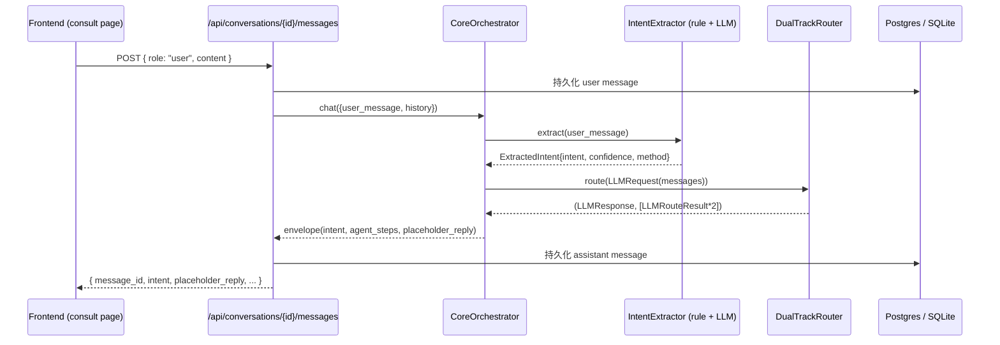

# BOIP Agent 清单与编排流程（Phase 1 / T06）

本文档汇总 BOIP 已注册的 Agent、`invoke` 协议、编排流程与 NLU / LLM 集成入口。

---

## 1. Agent 清单

| Name | Class | Stage | Phase 1 状态 |
|---|---|---|---|
| `core` | `agents.core.agent.CoreAgent` | orchestrator | 已注册；提供 `CoreOrchestrator.chat()` |
| `environment` | `agents.environment.agent.EnvironmentAgent` | context | 已注册；待真实上下文接入 |
| `vision` | `agents.vision.agent.VisionAgent` | context | 已注册；待真实视觉模型接入 |
| `design` | `agents.design.agent.DesignAgent` | candidate | 已注册；待设计模型接入 |
| `engineering` | — | candidate | **未实现**（TD-005） |

注册入口：`agents/config.yaml::agents.*` + `agents/loader.py::load_agents()`。

---

## 2. Invoke 协议

### 2.1 `AgentContext`
```python
AgentContext(
    request_id="<uuid>",
    tenant_id=<uuid>,
    user_id=<uuid>,
    payload={...},
    history=[...],   # 可���
)
```

### 2.2 `AgentResult`
```python
AgentResult(
    success=True,
    data={...},                       # 业务结果
    evidence=(Evidence(...),),        # 至少 1 条 evidence
    error=None,
)
```

### 2.3 信封
所有 invoke 调用通过 `AgentResult.to_envelope()` 序列化为：
```json
{ "success": true, "data": {...}, "evidence": [{...}] }
```

---

## 3. Core Orchestrator chat 流程



---

## 4. 编排管道

| 阶段 | Agent | 输入 | 输出 |
|---|---|---|---|
| intent | `IntentExtractor` | user_message | `ExtractedIntent` |
| context | `EnvironmentAgent` | intent + payload | 环境参数 |
| context | `VisionAgent` | context + image refs | 视觉特征（pending） |
| candidate | `DesignAgent` | vision + intent | 设计候选（pending） |
| candidate | `EngineeringAgent` | design + intent | 工程评估（pending，TD-005） |

每个 Agent 都运行在 `agents.registry.AgentRegistry` 单例中，`enabled=false` 的 Agent 在编排阶段会被标记为 `not_registered`。

---

## 5. NLU 模块

文件：`agents/core/nlu.py`

- `Intent` 枚举：`consult / create_project / query_status / explain_plan / review_trigger / unknown`
- `IntentExtractor.extract(text)`：先规则后 LLM 增强；LLM 失败时回退到规则结果。
- LLM 增强入口：`build_llm_messages_for_intent(user_text, candidates)` 构造 `[system, user]` 两条消息。

---

## 6. LLM 模块

文件：`agents/llm/*`

- 抽象类 `LLMProvider` + 两个具体实现 `OpenAICompatProvider` / `AnthropicCompatProvider`。
- `DualTrackRouter` 同时启动 track_a / track_b，按 strategy 选最终响应。
- `MockProvider` 在 API key 缺失时自动启用，确保调用方永不崩溃。
- 详见 `docs/LLM.md`。

---

## 7. 已知债 / 占位

- TD-005：engineering 阶段未实现。
- TD-006：LLM 模型选型未定。
- TD-013 / TD-014：双轨 LLM 成本/性能 + 真实 key 接入。
- 所有业务字段保持 `pending_verification`。