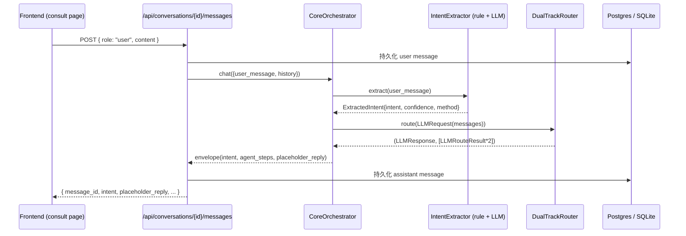

# BOIP Agent 清单与编排流程（Phase 1 / T06）

本文档汇总 BOIP 已注册的 Agent、`invoke` 协议、编排流程与 NLU / LLM 集成入口。

---

## 1. Agent 清单

| Name | Class | Stage | 状态（Phase 2） |
|---|---|---|---|
| `core` | `agents.core.agent.CoreAgent` | orchestrator | 已注册；提供 `CoreOrchestrator.chat()` |
| `environment` | `agents.environment.agent.EnvironmentAgent` | context | **已真实接入**（走 `role=TEXT` provider）；2.2.1 增强：数据 Provider 抽象（`providers/` base/mock/factory，默认 disabled）+ `field_provenance` 三要素溯源 + Level 0 推理永远 `pending_verification` |
| `vision` | `agents.vision.agent.VisionAgent` | context | **已真实接入**（多模态 `HY-Vision-2.0-Instruct`，走 `role=VISION` provider，输出视觉特征 JSON） |
| `design` | `agents.design.agent.DesignAgent` | candidate | **已真实接入**（走 `role=TEXT` provider）；2.2.2 增强：经济/舒适/高性能三方案专业化 + `thresholds/verified.json` 阈值治理（verified 一票否决，全部待专家转正）+ `decision_trace` |
| `engineering` | `agents.engineering.agent.EngineeringAgent` | candidate | **骨架已建（2.1.5）**：五分析接口（wind_pressure/glass_safety/profile/hardware/installation_risk）统一四字段输出 + `EngineeringValidation` 审核链；`config.yaml` 登记但 **`enabled:false` 不进管道**，零真实工程计算（pending_verification） |

注册入口：`agents/config.yaml::agents.*` + `agents/loader.py::load_agents()`。

> Phase 2 已落地 **真实三 Agent 链**（Environment → Vision → Design），由后端 `/api/analysis/run` 与 `/api/report/generate` 编排，详见 §8。
> Phase 2.2.5 新增 **Embedding/RAG 基础设施**：`agents/llm/embedding.py`（EmbeddingProvider 抽象）+ `backend/app/core/rag/`（chunking / vector_store / ingestion 强制溯源），经 `/api/rag/*` 暴露；详见 `docs/LLM.md` 与 `docs/API.md`。

---

## 2. Invoke 协议

### 2.1 `AgentContext`
```python
AgentContext(
    request_id="<uuid>",
    tenant_id=<uuid>,
    user_id=<uuid>,
    payload={...},
    history=[...],   # 可���
)
```

### 2.2 `AgentResult`
```python
AgentResult(
    success=True,
    data={...},                       # 业务结果
    evidence=(Evidence(...),),        # 至少 1 条 evidence
    error=None,
)
```

### 2.3 信封
所有 invoke 调用通过 `AgentResult.to_envelope()` 序列化为：
```json
{ "success": true, "data": {...}, "evidence": [{...}] }
```

---

## 3. Core Orchestrator chat 流程



---

## 4. 编排管道

| 阶段 | Agent | 输入 | 输出 |
|---|---|---|---|
| intent | `IntentExtractor` | user_message | `ExtractedIntent` |
| context | `EnvironmentAgent` | intent + payload | 环境参数（真实 LLM） |
| context | `VisionAgent` | context + image refs | 视觉特征 JSON（真实多模态） |
| candidate | `DesignAgent` | vision + intent | 设计候选（真实 LLM） |
| candidate | `EngineeringAgent` | design + intent | 骨架已建（2.1.5），`enabled:false` 不进管道；工程计算闭环属 Phase 3 主线 |

每个 Agent 都运行在 `agents.registry.AgentRegistry` 单例中，`enabled=false` 的 Agent 在编排阶段会被标记为 `not_registered`。

---

## 5. NLU 模块

文件：`agents/core/nlu.py`

- `Intent` 枚举：`consult / create_project / query_status / explain_plan / review_trigger / unknown`
- `IntentExtractor.extract(text)`：先规则后 LLM 增强；LLM 失败时回退到规则结果。
- LLM 增强入口：`build_llm_messages_for_intent(user_text, candidates)` 构造 `[system, user]` 两条消息。

---

## 6. LLM 模块

文件：`agents/llm/*`

- 抽象类 `LLMProvider` + 具体实现 `OpenAICompatProvider`（openai_compat，含多模态）/ `AnthropicCompatProvider` / `MockProvider`。
- `DualTrackRouter` 同时启动主轨（角色 provider）/ 副轨（fallback=mock），按 strategy 选最终响应；`build_router_from_config(config, role=ProviderRole.*)` + `resolve_provider` 实现文本/视觉/embedding 角色解耦（Phase 2.1.6）。旧 `modality=` 参数保留为 deprecated 别名。
- `MockProvider` 在 API key 缺失时自动启用，确保调用方永不崩溃。
- 详见 `docs/LLM.md`。

---

## 7. 已知债 / 占位

- TD-005：EngineeringAgent 骨架已建（2.1.5），启用与真实计算闭环待 Phase 3（需专家签字）。
- TD-006：LLM 模型选型未定（Phase 2 定为 TokenHub 多模态）。
- TD-013 / TD-014：双轨 LLM 成本/性能 + 真实 key 接入（TD-014 已 RESOLVED）。
- 所有业务字段保持 `pending_verification`。

---

## 8. 分析与报告编排（Phase 2）

Phase 2 在真实三 Agent 链之上新增两条后端路由，由 `CoreOrchestrator` 之外的分析/报告编排器驱动：

| 路由 | 角色 | 说明 |
|---|---|---|
| `POST /api/analysis/run` | 分析编排 | 串联 Environment → Vision → Design Agent，产出结构化分析报告（`AgentResult` 信封 + evidence） |
| `POST /api/report/generate` | 报告生成 | 调用 `ReportGenerator` 将分析结果渲染为 PDF / 结构化文档 |

- **ReportGenerator**：`agents/*/report.py`（或 `backend/app/report/`）负责把 `AgentResult.data` + `evidence` 渲染为最终交付物（PDF 报告、Markdown 等）。
- 调用方：前端"生成报告"动作 → `POST /api/report/generate` → `ReportGenerator` → 返回可下载报告 URL / 文件流。
- 证据链：每条 Agent 输出都带 `evidence`，报告内引用原始 `agent_steps[*]` 便于审计。

详见 `docs/API.md` 的 `/api/analysis/run` 与 `/api/report/generate` 章节。