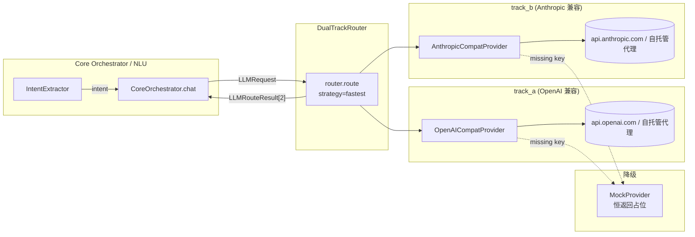

# BOIP LLM 双轨架构（Phase 1 / T06c）

本文件描述 BOIP 在 Phase 1 引入的 **双轨 LLM（Dual-Track LLM）** 抽象、provider 切换流程、成本/性能占位指标，以及 `pending_verification` 状态。
Phase 1.0 默认 `llm.enabled=false`，所有真实 API key 由主理人（轩哥）补全后再开启。

---

## 1. 双轨架构图

- **同时启动** track_a / track_b；任一条 track 缺 API key 自动降级到 `MockProvider`；
- 路由器按 `strategy`（fastest / first / consensus / fallback）选最终响应；
- 任何一条 track 失败都把 `error` + `latency_ms` 落到 `LLMRouteResult`，便于证据链追踪。

---

## 2. Provider 切换指南

1. 在 `.env` 中填入 `LLM_A_API_KEY=sk-...` 与 `LLM_B_API_KEY=sk-ant-...`（**绝不提交到 git**）；
2. 修改 `agents/config.yaml::llm.enabled = true`；
3. 重启后端 / Agent 服务；`agents.llm.router.build_router_from_config()` 会自动构造双 provider；
4. 观察 `agent_steps.llm_routes[*].latency_ms` 与 `error` 字段是否落在合理范围；
5. 评估完成后回填 `docs/LLM.md` §4 表格。

> ⚠️ Phase 1.0 必须保持 `llm.enabled=false`，否则即便 mock 也可能在 frontend 出现假响应导致评测失真。

---

## 3. 代码入口

| 文件 | 角色 |
|---|---|
| `agents/llm/base.py` | `LLMProvider` 抽象类 + 异常 |
| `agents/llm/types.py` | `LLMRequest` / `LLMResponse` / `LLMRouteResult` 数据结构 |
| `agents/llm/openai_compat.py` | OpenAI 兼容协议 provider |
| `agents/llm/anthropic_compat.py` | Anthropic 兼容协议 provider |
| `agents/llm/mock.py` | 无网络占位 provider |
| `agents/llm/router.py` | `DualTrackRouter` 双轨选路 |
| `agents/llm/__init__.py` | 顶层导出 |

---

## 4. 成本 / 性能占位（pending_verification）

下表留空等待真实 API key 接入后回填；任何"假数据"必须在此处显式标注 `pending_verification`。

| 指标 | track_a (OpenAI 兼容) | track_b (Anthropic 兼容) | 备注 |
|---|---|---|---|
| provider | openai_compat | anthropic_compat | 来自 `agents/config.yaml` |
| model | gpt-4o | claude-3-5-sonnet-20241022 |  |
| 平均延迟 (p50) | pending_verification | pending_verification |  |
| 平均延迟 (p95) | pending_verification | pending_verification |  |
| 单调用成本 (USD) | pending_verification | pending_verification |  |
| 月度预估成本 (USD) | pending_verification | pending_verification |  |
| 失败率 (24h) | pending_verification | pending_verification |  |
| 是否启用 | false | false | 与 `llm.enabled` 同步 |

> 月度预估由主理人（轩哥）按真实账单/账单预测工具回填；目前阶段不连接任何云服务。

---

## 5. 相关技术债

- **TD-013** — 双轨 LLM 成本/性能待评测（高）。
- **TD-014** — 真实 API key 接入（高，待轩哥填）。
- **TD-006** — LLM 模型选型未定（中）。

详见 `BOIP_AI_Documents/technical_debt.md`。