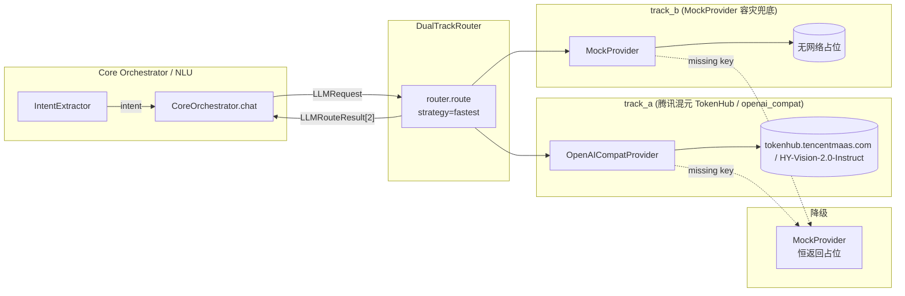

# BOIP LLM 双轨架构（Phase 1 / T06c）

本文件描述 BOIP 在 Phase 1 引入的 **双轨 LLM（Dual-Track LLM）** 抽象、provider 切换流程、成本/性能占位指标，以及 `pending_verification` 状态。
当前（Phase 2.2 COMPLETED）`llm.enabled=true`，`providers.text` / `providers.vision` 指向腾讯混元 TokenHub `HY-Vision-2.0-Instruct`（openai_compat，多模态）；`providers.fallback=mock` 为容灾兜底。Provider 唯一事实源为 `.env::LLM_A_*`（见 `.ai/decisions/ADR-001-provider-alignment.md`）。

> **Phase 2.1.6 Provider 架构解耦**：引入显式 `ProviderRole`（`text` / `vision` / `embedding` / `fallback`）与 `config.yaml::llm.providers` 命名注册表。`build_router_from_config(config, role=)` 按角色解析主轨 provider、副轨恒为 `fallback`（mock）。旧 `modality=` 参数保留为 **deprecated 兼容别名**（映射 vision/text）；旧 `track_a`/`track_b` 键仍被 `resolve_provider` **兼容解析**（不作新配置入口）。

> **Phase 2.2.5 Embedding 落地**：`agents/llm/embedding.py` 提供 `EmbeddingProvider(ABC)` + `MockEmbeddingProvider`（确定性内容哈希向量，CI 默认）+ `OpenAICompatEmbeddingProvider`（真实 `/embeddings` 端点，零新依赖）；`router.py::build_embedding_provider` 真正构造 provider（`disabled` → `None` 保持兼容）。消费者为 `backend/app/core/rag/`（经 `BOIP_EMBEDDING_PROVIDER` 环境切换，默认 `mock`；真实向量服务接入待主理人排期）。

---

## 1. 双轨架构图

- **同时启动** track_a / track_b；任一条 track 缺 API key 自动降级到 `MockProvider`；
- 路由器按 `strategy`（fastest / first / consensus / fallback）选最终响应；
- 任何一条 track 失败都把 `error` + `latency_ms` 落到 `LLMRouteResult`，便于证据链追踪。

---

## 2. Provider 切换指南

1. 在 `.env` 中填入 `LLM_A_API_KEY=sk-...`（**绝不提交到 git**）；`providers.fallback` 为 `mock`，无需 key；
2. `agents/config.yaml::llm.enabled` 在 Phase 2 已为 `true`（遗留 `llm_enabled` 键已弃用，见 ADR-001）；
3. 重启后端 / Agent 服务；`agents.llm.router.build_router_from_config(config, role=ProviderRole.TEXT)` 按 `llm.providers` 注册表自动构造双 provider；
4. 观察 `agent_steps.llm_routes[*].latency_ms` 与 `error` 字段是否落在合理范围；
5. 评估完成后回填 `docs/LLM.md` §4 表格。

> 注：Phase 1.0 曾要求保持 `llm.enabled=false` 以避免评测失真；Phase 2 已正式开启 `llm.enabled=true`，`providers.text/vision` 接腾讯混元 TokenHub 真实多模态，评测以真实证据链为准。
>
> **兼容说明（2.1.6）**：`build_router_from_config` 仍接受旧 `modality="vision"` 弃用参数（等价 `role=ProviderRole.VISION`）；`resolve_provider` 在 `providers` 块缺失时仍回落旧 `track_a` / `track_b` 键，但新配置一律以 `llm.providers.*` 为入口。

---

## 3. 代码入口

| 文件 | 角色 |
|---|---|
| `agents/llm/base.py` | `LLMProvider` 抽象类 + 异常 |
| `agents/llm/types.py` | `LLMRequest` / `LLMResponse` / `LLMRouteResult` 数据结构 |
| `agents/llm/openai_compat.py` | OpenAI 兼容协议 provider |
| `agents/llm/anthropic_compat.py` | Anthropic 兼容协议 provider |
| `agents/llm/mock.py` | 无网络占位 provider |
| `agents/llm/router.py` | `DualTrackRouter` 双轨选路；`ProviderRole` 枚举 + `resolve_provider` / `build_router_from_config(role=)` / `build_embedding_provider` |
| `agents/llm/__init__.py` | 顶层导出 |

---

## 4. 成本 / 性能占位（pending_verification）

下表为 Phase 2 真实接入后的占位/实测状态；任何"假数据"仍显式标注 `pending_verification`。

| 指标 | track_a (腾讯混元 TokenHub) | track_b (Mock 容灾) | 备注 |
|---|---|---|---|
| provider | openai_compat | mock | 来自 `agents/config.yaml` |
| model | HY-Vision-2.0-Instruct（多模态 text+vision 共享） | —（恒返回占位） | 容灾兜底，不接真实网络 |
| 平均延迟 (p50) | pending_verification | — | 待 TokenHub 账单/网关日志回填 |
| 平均延迟 (p95) | pending_verification | — |  |
| 单调用成本 (USD) | pending_verification | — |  |
| 月度预估成本 (USD) | pending_verification | — |  |
| 失败率 (24h) | pending_verification | — |  |
| 是否启用 | true | true（仅降级的容灾兜底） | 与 `llm.enabled` 同步 |

> 月度预估由主理人（轩哥）按真实账单/账单预测工具回填。
> **文本 / 视觉 / embedding provider 解耦（Phase 2.1.6 已落地）**：`agents/llm/router.py` 引入 `ProviderRole`（`text` / `vision` / `embedding` / `fallback`）+ `resolve_provider(config, role)`；`build_router_from_config(config, role=)` 主轨按 `llm.providers.{text,vision}` 解析、副轨恒为 `providers.fallback`（mock）。Vision Agent 走 `role=ProviderRole.VISION`，Environment/Design 走 `role=ProviderRole.TEXT`；`embedding` 角色已于 2.2.5 落地真实实现（Mock/OpenAICompat 双实现，消费者为 RAG 基础设施，默认 mock）。旧 `modality=` 参数保留为 deprecated 别名；旧 `track_a`/`track_b` 键仍被兼容解析。

---

## 5. 相关技术债

- **TD-013** — 双轨 LLM 成本/性能待评测（高，Phase 2 已接真实 key，待账单回填）。
- **TD-014** — 真实 API key 接入（**已 RESOLVED**：TokenHub `HY-Vision-2.0-Instruct` 已接入，Vision 多模态真实可用）。
- **TD-006** — LLM 模型选型未定（中，Phase 2 定为 TokenHub 多模态）。

详见 `BOIP_AI_Documents/technical_debt.md`。