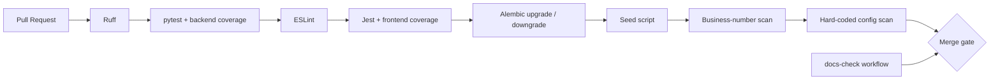

# BOIP 测试与持续集成指南

## 1. 测试目标与边界

Phase 0 的测试体系负责验证工程骨架、API 契约、数据库迁移和 Agent 框架，不验证任何建筑行业结论。所有未经过领域专家确认的业务规则继续使用 `pending_verification`，测试不得把占位数据解释为真实工程依据。

## 2. 测试金字塔

```text
              / E2E /              少量：真实 uvicorn 进程与 HTTP 链路
           / API·集成 /            中量：FastAPI 契约、迁移、数据库关系
        /      单元测试      /      大量：Agent、工厂、前端 API 客户端
```

| 层级 | 目录 | 运行器 | Phase 0 关注点 |
|---|---|---|---|
| 后端单元与集成 | `backend/tests/` | pytest | ORM、迁移、API、共享 fixtures |
| Agent 单元 | `tests/agents/` | pytest | 基类、注册表、加载器、编排器、四个 Agent |
| 跨端 E2E | `tests/e2e/` | pytest + uvicorn + HTTPX | 服务真实启动与核心路由可达性 |
| 前端单元 | `frontend/src/__tests__/` | Jest | 健康路由、fetch 客户端成功/失败契约 |

## 3. 覆盖率门槛

- 后端：语句/分支综合覆盖率门禁不低于 **60%**。该 Phase 0 门槛由 T05 指定；Phase 1 是否上调仍为 `pending_verification`。
- 前端：全局 statements / branches / functions / lines 均不低于 **50%**。Phase 0 只统计已形成稳定契约的 API 客户端与健康路由；扩展统计范围的时间点为 `pending_verification`。
- 覆盖率文件：后端生成 `backend/coverage.xml`；前端生成 `frontend/coverage/`（含 LCOV 与 JSON summary）。
- 禁止以删除测试、排除已测稳定模块或 `--no-cov` 规避门禁。

## 4. 常用命令

### 完整本地 CI

```bash
bash scripts/ci/local_ci.sh
```

### Phase 0 一键验收

```bash
bash scripts/ci/check_phase0_done.sh
```

### 后端

```bash
cd backend
.venv/bin/python -m pytest --cov=app --cov=agents --cov-report=term-missing --cov-fail-under=60
```

### 前端

```bash
cd frontend
npm run lint
npm test -- --runInBand --coverage
```

## 5. CI 流水线



`.github/workflows/ci.yml` 在 Pull Request 上调用与本机相同的 `local_ci.sh`，避免本地与云端维护两套命令。`.github/workflows/docs-check.yml` 独立确认 `docs/PHASE0_LOG.md` 与 `docs/CHANGELOG.md` 都随代码更新。

## 6. 共享 fixtures 与工厂

`backend/conftest.py` 提供：

- `db_session`：每个测试独立的 SQLite 内存数据库，测试后回滚、删表并释放引擎；
- `client`：已初始化 Agent 注册表的 `TestClient`；
- `agent_registry`：每个测试前加载、测试后清空的全局注册表；
- `auth_token`：只用于测试依赖覆盖的非密钥 Bearer 字符串。

`backend/tests/factories.py` 提供 tenant / user / project 工厂，默认数据不包含行业测量值。

## 7. 故障排查

### Ruff 命令不存在

执行 `backend/.venv/bin/python -m pip install -r backend/requirements.txt`。CI 脚本会优先使用项目虚拟环境中的 Ruff。

### pytest 提示覆盖率不足

查看终端 `Missing` 列以及 `backend/coverage.xml`，为未覆盖的公共分支补测试。不要降低门槛绕过失败；如门槛调整确有必要，必须记录 `technical_debt.md` 并由主理人确认。

### Jest 找不到 jsdom 或 jest-dom

在仓库根目录执行 `npm ci`，确保 workspace 依赖与根 `package-lock.json` 一致。随后在 `frontend/` 重跑 `npm test -- --runInBand --coverage`。

### E2E 服务启动超时

确认当前 Python 环境已安装 `uvicorn` 和 `httpx`，本机回环地址可用，且没有安全软件阻止测试子进程。测试使用操作系统分配的空闲端口，不依赖固定业务端口。

### Alembic 迁移失败

删除上一次异常留下的本地临时数据库后重跑。CI 使用独立临时 SQLite 文件并强制执行 `upgrade head` 后 `downgrade base`；生产 PostgreSQL 一致性仍按 TD-011 跟踪。

### 扫描脚本报业务数字或硬编码

不得简单加入忽略规则。先确认数据是否有可审计来源；没有来源时删除该数字或标记 `pending_verification`，并在技术债中说明偿还计划。
