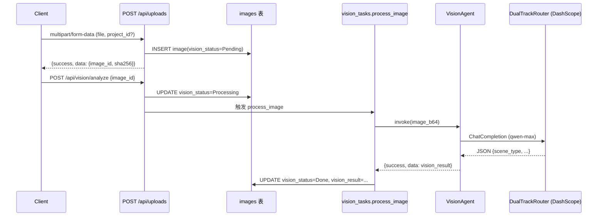

# Vision Agent & 图片上传（Phase 1 / T08）

> 状态：Phase 1 最小骨架（IS_PASS：等测试验证）
> 文档版本：V1.0 / 日期 2026-07-24 / 责任人：软件工程师 寇豆码

---

## 1. 职责

- 接收用户上传的阳台 / 落地窗 / 建筑立面图片
- 调用 Vision Agent 提取场景信息：场景类型、障碍物、朝向线索、清晰度、建议
- 把 vision_status 写入 `images` 表，结果返回前端

## 2. 流程图



## 3. 数据契约

### POST /api/uploads（multipart）

| 字段 | 类型 | 必填 | 说明 |
|---|---|---|---|
| file | File | 是 | jpg/jpeg/png/webp；单文件 ≤ 10MB（pending_verification） |
| project_id | UUID | 否 | 关联项目 |

返回 `{success: true, data: {image_id, sha256, vision_status: "Pending"}}`。

### POST /api/vision/analyze

请求体：`{image_id: UUID}`  
返回 `{success: true, data: {image_id, vision_result: {...}, pending_verification: true}}`。

### VisionResult 结构（LLM 输出，strict JSON）

```json
{
  "scene_type": "开放阳台 / 封闭阳台 / 落地窗 / 飘窗 / 其他",
  "obstructions": ["空调外机", "晾衣架"],
  "orientation_hint": "南向 / 北向 / 东向 / 西向 / 不确定",
  "quality": "清晰 / 一般 / 模糊",
  "recommendations": ["避免临街噪音，可考虑双层中空玻璃"]
}
```

## 4. 失败兜底

| 失败类型 | 行为 |
|---|---|
| 文件类型 / 体积不达标 | 返回 400 `{code:"INVALID_FILE"}` |
| LLM 鉴权失败（401） | vision_status=Failed + vision_result 占位（标 pending_verification） |
| LLM 超时（30s） | vision_status=Failed + 标记 retryable |
| 图片模糊（quality=模糊） | 不阻断流程，仍返回结果；UI 提示用户重新拍照 |
| 重复图片（sha256 已存在） | 复用 image_id，不重复入库（待 Phase 2 实现） |

## 5. 占位与待接入

| 模块 | 当前状态 | 待 Phase 2 接入 |
|---|---|---|
| 本地存储（backend/storage/uploads/） | 占位 | MinIO / S3（TD-015） |
| MCP.ImageQualityCheck | 占位 | 调用 Sharp / Pillow 做清晰度评估 |
| MCP.VisionAnalyze | 占位 | 接入 OCR / 物体识别增强 |
| Vision LLM prompt | 最小骨架 | 领域专家调优（TD-016） |

## 6. 安全边界

- 图片存 `backend/storage/{tenant_id}/{sha256}.{ext}`，**不做跨租户训练**
- 上传时校验 mime + sha256；同一 tenant 内去重
- Vision Agent 输出带 `pending_verification: true` 直到人工复核通过

## 7. 待确认事项

1. 图片清晰度阈值（pending_verification）
2. 体积上限（pending_verification；当前 10MB）
3. 图片保留周期（pending_verification；默认 90 天？合规边界）
4. 跨租户图片脱敏策略（pending_verification；法务复核）

---

详细变更见 `PHASE0_LOG.md` T08 章节 + `CHANGELOG.md` T08 条目。